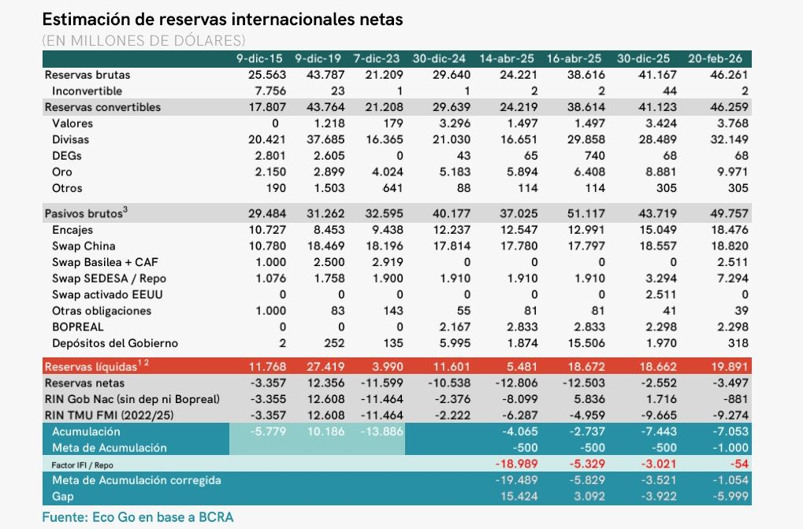
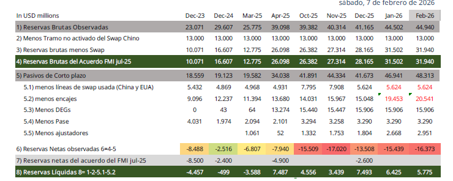

## Introduction

-   Todo el análisis anterior parte de considerar las reservas brutas del BCRA, tal como figuran en su balance.
-   Sin embargo, suele cuestionarse el uso de esta magnitud a la hora de calcular un tipo de cambio de equilibrio, porque esos fondos no estarían completamente disponibles para funcionar de reserva de los pasivos del BCRA.
-   No existen publicaciones oficiales que muestren esta magnitud, en la mayoría de los casos son consultoras las que los publican.

**¿Por qué calculamos las reservas netas?**

Cuando observamos los pasivos del BCRA, notamos que muchos de ellos son obligaciones a corto plazo, que se corresponden a una gran proporción del total de reservas. \\ $\implies$ Cuántas  reservas  tenemos  realmente?

\begin{center}
\includegraphics[width=0.8\linewidth]{R Brutas.jpg}
\end{center}

Para definir las reservas netas es necesario discriminar entre aquellos activos externos que el banco central tiene en su pocecion y no posee una obligación de corto plazo contra ellas.

**Calculo de Reservas Netas**

Existen distintas consideraciones que se pueden encontrar entre los consultores que calculan las reservas Netas; ya que el objetivo de las reservas netas es conocer cual es la capacidad que tiene el BCRA con reservas propias de hacer frente a las distintas contingencias.

Por lo tanto se pueden tomar dos consideraciones diferentes:

-  Para obtener las *Reservas Netas* restar de las reservas brutas todos lo pasivos de corto plazo que pertenecen a entidades distintas al BCRA.

-  Para obtener las *Reservas SUPER Netas* puede tomarse el metodo de *obligaciones a un año vistas* que consiste en restar de las reservas brutas todos lo pasivos que deben cancelarce en el proximo año.


Como puede observarse ambas definiciones son muy cercanas, y se modifican algunas partidas a considerar entre ellas, lo relevante es recordar que las reservas netas son aquellas que el BCRA no tiene una "promesa" frente a ellas, por lo que tiene libre disponibilidad para su uso. De modo que cuando las reservas netas son negativas quiere decir que el BCRA ha prometido pagos en el corto plazo por importes mayores de lo que dispone, o ha hecho uso de partidas en monedas entranjera que si bien estan depositados en el BCRA no son su capital, como por ejemplo los encajes en dolares.


-   Encajes en moneda extranjera
-   Depositos del tesoro en moneda extranjera
-   Deudas con org. Multilaterales (venc. a 1 año)
-   Bopreal (venc. a 1 año)
-   Swap
-   DEGs



Observando la estimacion de la Consultora *EcoGo* podemos ver como al calcular las reservas netas, tienen distintas consideracion al asignar o no distintas partidas en su calculo. Otras consultoras como *PxQ* utilizan el metodo de "obligacion a un año vistas" o lo que puede llamarse "super netas".




El informe de la Alic *Allaria* imputa pasivos que no son relevantes o deja de imputar otros por ejemplo el *Bopreal*. Ademas es un buen ejemplo que seguir la definicion de reservas netas conceptualmente. Podemos ver que Allaria no resta los *Depositos del tesoro en moneda extranjera*, considerandolos propios para que el BCRA cumpla con sus obligaciones, en ese caso es necesario considerar como propias las obligaciones que el tesoro tiene en el corto plazo en moneda extrangera, en particular los vencimientos frente a los organismos Internacionales.

## Calculo de reservas Netas

La relevancia de este metodo de calculo es que obtengo cuales son los verdaderos activos externos que posee el BCRA para hacer frente a sus obligaciones o contingencias de corto plazo.

### Esquema de cálculo de reservas internacionales

| Etapa | Concepto | Cálculo | Interpretación económica |
|----------|--------------|--------------------------|----------------|
| 1 | **Reservas Brutas** |  Oro + Divisas + DEG + Otros activos externos | Total de activos externos del BCRA |
| 2 | **Pasivos Brutos en moneda extranjera** | Encajes + Swap + Otras obligaciones + BOPREAL + Depósitos del Gobierno | Compromisos en USD del BCRA |
| 3 | **Reservas Netas (RIN)** | Reservas Brutas − Pasivos Brutos | Posición neta del BCRA en moneda extranjera |
| 4 | **Reservas Líquidas** | Reservas Brutas − Activos no líquidos (DEG, Oro, Valores, Otros) | Divisas de disponibilidad inmediata |


## Calculo de reservas Netas "a un año vista" o "Reservas SUPER netas"

La relevancia de este metodo de calculo es que obtengo cuales son los verdaderos activos externos que posee el BCRA para hacer frente a sus contingencias luego de considerar las obligaciones a un año vista que posee el BCRA (y el tesoro nacional).

### Cálculo de Reservas SUPER Netas (método “obligaciones a 1 año”)

| Paso | Componente | Signo | ¿Qué representa? |
|-----|--------------|-------|-----------------------|
| 1 | **Reservas brutas** | SUMA | Stock total de activos externos del BCRA (oro, divisas, DEG, etc.) |
| 2 | Encajes en moneda extranjera | RESTA | Depósitos en USD del sistema bancario en el BCRA (no son patrimonio del BCRA) |
| 3 | Deudas con org. multilaterales (venc. ≤ 1 año) | RESTA | Pagos próximos (FMI, BM, BID, etc.) **Pasivos del TESORO**  |
| 4 | BOPREAL (venc. ≤ 1 año) | RESTA |Cronograma de vencimientos del BOPREAL a 1 año|
| 5 | Swap  | RESTA | Tramo del swap considerado no disponible o exigible |

**Definición operativa:**

$$
RN_t = RB_t - Encajes_t  - DeudaMult_{t, \le 1a} - BOPREAL_{t, \le 1a} - Swap_t
$$


[Balance diario](https://www.bcra.gob.ar/PublicacionesEstadisticas/Cuadros_estandarizados_series_estadisticas.asp)

[Deuda con Organismos Multilaterales](https://www.argentina.gob.ar/economia/finanzas/datos-trimestrales-de-la-deuda)

[Balance BCRA](https://www.bcra.gob.ar/balances-y-agregados-monetarios/)

[acuerdo Fondo](https://www.argentina.gob.ar/noticias/argentina-anuncia-un-programa-de-facilidades-extendidas-con-el-fondo-monetario)

[Noticia Chequeado, acuerdo fondo](https://chequeado.com/el-explicador/acuerdo-con-el-fmi-que-implica-el-nuevo-endeudamiento-que-negocia-el-gobierno-de-javier-milei/)


```{python}
#| code-fold: true
#| code-summary: "Mostrar código"

import pandas as pd
import numpy as np
import yfinance as yf
import matplotlib.pyplot as plt
import seaborn as sns


import pandas as pd
import numpy as np
import yfinance as yf
import matplotlib.pyplot as plt
import seaborn as sns


#Vamos cargar la data al codigo, tenemos gran parte en este excel.
archivo = "deuda multilaterales.xlsx" 

deuda_multi = pd.read_excel(archivo, sheet_name="deuMult")
encajes = pd.read_excel(archivo, sheet_name="dep y encajes")
bop_1 = pd.read_excel(archivo, sheet_name="bopreal_1")
bop_2 = pd.read_excel(archivo, sheet_name="bopreal_2")
bop_3 = pd.read_excel(archivo, sheet_name="bopreal_3")
bop_4 = pd.read_excel(archivo, sheet_name="bopreal_4")


#Vamos a trabajar con periodos mensuales, por lo cual configuramos la fecha de esta forma

bop_2['fecha'] = pd.to_datetime(bop_2['fecha'])
bop_2['fecha'] = bop_2['fecha'].dt.to_period('M')

bop_1['fecha'] = pd.to_datetime(bop_1['fecha'])
bop_1['fecha'] = bop_1['fecha'].dt.to_period('M')

bop_3['fecha'] = pd.to_datetime(bop_3['fecha'])
bop_3['fecha'] = bop_3['fecha'].dt.to_period('M')

bop_4['fecha'] = pd.to_datetime(bop_4['fecha'])
bop_4['fecha'] = bop_4['fecha'].dt.to_period('M')


#Hacemos el merge de las columnas que nos interesan en base a la columna fecha

bop = (
    bop_1
    .merge(bop_2, on='fecha', how='outer')
    .merge(bop_3, on='fecha', how='outer')
    .merge(bop_4, on='fecha', how='outer')
)


# Poner fecha como índice
bop = bop.set_index('fecha')

# Crear rango completo mensual, ya que que los flujos de fondos del bopreal pueden saltear meses

rango_completo = pd.period_range(
    start=bop.index.min(),
    end=bop.index.max(),
    freq='M'
)

# Reindexar (esto agrega los meses faltantes con NaN)
bop = bop.reindex(rango_completo)


# Suma de los vencimientos de los Bopreal a 1 año vistas

bop['Bopreal'] = bop.sum(axis=1)
bop['bop_año'] = (
    bop['Bopreal'][::-1]
    .rolling(12)
    .sum()[::-1]
)


# Trabajamos con las Deudas con los Org. Multilaterales


deuda_multi.index=deuda_multi['fecha']
deuda_multi['suma un año']= (
    deuda_multi["vencimiento"][::-1]
    .rolling("365D")
    .sum()[::-1]
)/1000

deuda_multi = deuda_multi.drop(columns=['fecha','vencimiento'])
deuda_multi=deuda_multi.rename(columns={'suma un año':'deuda_mult'})


#Trabajamos con los encajes

encajes.index=encajes['fecha']
encajes=encajes.drop(columns=['fecha'])
encajes['dep_Nac_ext']=encajes['dep_Nac_ext']/1000
encajes['encajes_ext']=encajes['encajes_ext']/1000


#Vamos con el Swap con China

#tc del Yuan

tc_yuan_excel= "tc_yuan.xlsx"

tc_yuan = pd.read_excel(tc_yuan_excel)

# Normalizar fechas a inicio de mes para hacer el merge
tc_yuan['Fecha'] = pd.to_datetime(tc_yuan['Fecha'], format='%d.%m.%Y')

tc_yuan['fecha'] = tc_yuan['Fecha'].dt.to_period('M').dt.to_timestamp()
tc_yuan['Último']=tc_yuan['Último']/10000

# Tomar el último valor disponible por mes
tc_yuan_mensual = tc_yuan.sort_values('Fecha').groupby('fecha')['Último'].last().reset_index()


swap_china = pd.DataFrame({
    'fecha': pd.date_range(start='2020-01-01', periods=75, freq='MS'),
    'yuanes': 130_000_000
})


# Merge con swap_china
swap_china = swap_china.merge(tc_yuan_mensual, on='fecha', how='left')

# Calcular monto en usd
swap_china['swap_usd'] = swap_china['yuanes'] / swap_china['Último']
swap_china['swap_usd']=swap_china['swap_usd']/1000
swap_china = swap_china.set_index('fecha')


#trabajamos con las Reservas Brutas


reservas_excel="reservas.xlsx"

reservas = pd.read_excel(reservas_excel)


reservas['fecha'] = pd.to_datetime(reservas['Fecha'])
reservas=reservas.set_index('fecha')


#hacemos todos los merge


df=deuda_multi.merge(encajes['dep_Nac_ext'], left_index=True, right_index=True, how="left")
df_c=df.merge(encajes['otros pasivos_usd'], left_index=True, right_index=True, how="left")


df_b=df_c.merge(reservas['Reservas mensuales'], left_index=True, right_index=True, how="left")

df_a=df_b.merge(swap_china['swap_usd'], left_index=True, right_index=True, how="left")

df_1=df_a.merge(encajes['encajes_ext'], left_index=True, right_index=True, how="left")


df_1=df_1['2020-01-01':'2026-01-01']
df_1.index = pd.to_datetime(df_1.index)
df_1.index = df_1.index.to_period('M')

df_1=df_1.merge(bop['bop_año'], left_index=True, right_index=True, how="left")
df_1['otros pasivos_usd']=df_1['otros pasivos_usd']-df_1['swap_usd']
df_1=df_1[['Reservas mensuales', 'encajes_ext', 'swap_usd','bop_año','dep_Nac_ext','otros pasivos_usd','deuda_mult']]
df_1=df_1.fillna(0)


df_1['Res_net']=df_1['Reservas mensuales']-df_1['encajes_ext']-df_1['swap_usd']-df_1['bop_año']-df_1['dep_Nac_ext']-df_1['otros pasivos_usd']
df_1['Res_Super_net']=df_1['Reservas mensuales']-df_1['encajes_ext']-df_1['swap_usd']-df_1['bop_año']-df_1['dep_Nac_ext']-df_1['otros pasivos_usd']-df_1['deuda_mult']

```


```{python}
#| code-fold: true
#| code-summary: "Mostrar código"


import plotly.graph_objects as go

# Convert index to datetime
plot_index = df_1.index.to_timestamp()

color_net = "#1f4e79"
color_super = "#a61c1c"

fig = go.Figure()

fig.add_trace(go.Scatter(
    x=plot_index,
    y=df_1['Res_net'],
    mode='lines',
    name='Reservas Netas',
    line=dict(color=color_net, width=3)
))

fig.add_trace(go.Scatter(
    x=plot_index,
    y=df_1['Res_Super_net'],
    mode='lines',
    name='Reservas Super Netas',
    line=dict(color=color_super, width=3)
))

# Línea cero
fig.add_hline(
    y=0,
    line_dash="dash",
    line_color="black",
    opacity=0.6
)

# Últimos valores
fig.add_annotation(
    x=plot_index[-1],
    y=df_1['Res_net'].iloc[-1],
    text=f"{df_1['Res_net'].iloc[-1]:,.0f}",
    showarrow=False,
    font=dict(color=color_net, size=12)
)

fig.add_annotation(
    x=plot_index[-1],
    y=df_1['Res_Super_net'].iloc[-1],
    text=f"{df_1['Res_Super_net'].iloc[-1]:,.0f}",
    showarrow=False,
    font=dict(color=color_super, size=12)
)

fig.update_layout(

    title=dict(
        text="Reservas Internacionales del BCRA",
        x=0,
        font=dict(size=18)
    ),

    yaxis_title="Millones de USD",

    template="simple_white",

    legend=dict(
        orientation="h",
        y=1.05,
        x=0
    ),

    yaxis=dict(
        tickformat=",",
        showgrid=True,
        gridcolor="rgba(0,0,0,0.1)"
    ),

    xaxis=dict(
        showgrid=False
    ),

    margin=dict(l=40, r=20, t=60, b=40)

)

fig.show()

```
